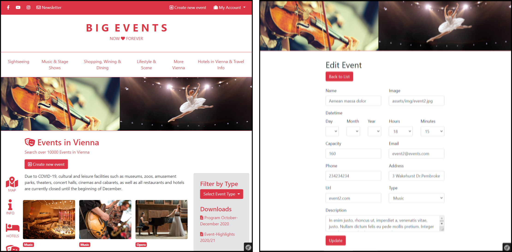

# CFLMS CodeReview 13 (Marin Balabanov)

This is an exercise project for a fictional global event management company. This web application enables users to see all available events, and - if they are logged in - to edit and delete them. 

These are the data fields available for each event:
- Event’s name
- Event’s date and start time
- Event’s description
- Event’s image (link to the image)
- Event’s capacity (number of persons)
- Event’s contact e-mail
- Event’s contact phone number
- Event’s address (physical location, including street name and number, ZIP code and city name)
- Event’s URL
- Event’s Type (predefined list like “music”, “sport”, “movie”, “theater” etc.).

The exercise is modeled on the official website of WienTourismus: https://events.wien.info/en/

## Installation

Before you start, please make sure you have installed __PHP__, __Composer__  and __Symfony__.

To install this project, please clone the __repository__ or download the __ZIP file__ at https://github.com/mbalabanov/CFLMS-MarinBalabanov-CodeReview-13/blob/main/CFLMS-MarinBalabanov-CodeReview-13.zip (Out of file size considerations, please kindly note that the ZIP does not include the "var" and "vendor" directories. They will be installed when you run ```composer install```)

The repository contains a DB with example items at https://github.com/mbalabanov/CFLMS-MarinBalabanov-CodeReview-13/blob/main/db-export/cr13_marinbalabanov_bigevents.sql Import this to your database and change the env variables for the DB in the _.env_ file.

Start the application with ```php bin/console server:run```



## Use
Initially you can only see the events without being able to edit or delete existing items and create new items. Please go to the top right menu with __My Account__ and _login_ using ```user@gmail.com``` and ```123123``` or _register_ a new user.
